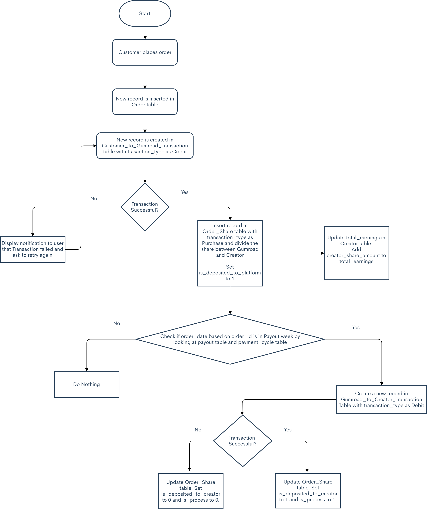

# Data Model Explanation

I created 8 Tables to handle purchases & refunds along with payment cycle. The tables are:

1. Payout
2. Creator
3. Product
4. Orders
5. Order_Share
6. Customer_To_Gumroad_Transaction
7. Gumroad_To_Creator_Transaction
8. Payment_Cycle

Let's see these tables in action below:

**Payout**

<table>
    <thead>
        <th>payout_id</th>
        <th>payout_month</th>
        <th>payout_date</th>
        <th>is_current_payout</th>
    </thead>
    <tbody>
        <tr>
            <td>1</td>
            <td>April</td>
            <td>02/04/2021</td>
            <td>0</td>
        </tr>
        <tr>
            <td>2</td>
            <td>April</td>
            <td>09/04/2021</td>
            <td>1</td>
        </tr>
        <tr>
            <td>3</td>
            <td>April</td>
            <td>16/04/2021</td>
            <td>0</td>
        </tr>
        <tr>
            <td>4</td>
            <td>April</td>
            <td>23/04/2021</td>
            <td>0</td>
        </tr>
    </tbody>
</table>

This table holds the data for the payout dates. 

**Creator**

<table>
    <thead>
        <th>creator_id</th>
        <th>creator_name</th>
        <th>creator_is_active</th>
        <th>total_earnings</th>
    </thead>
    <tbody>
        <tr>
            <td>1</td>
            <td>Zohaib</td>
            <td>1</td>
            <td>7.5</td>
        </tr>
    </tbody>
</table>

This table holds the data for the creator. 

**Product**

<table>
    <thead>
        <th>product_id</th>
        <th>creator_id</th>
        <th>product_name</th>
        <th>product_price</th>
    </thead>
    <tbody>
        <tr>
            <td>1</td>
            <td>1</td>
            <td>JavaScript & Data Structures Flashcards</td>
            <td>10</td>
        </tr>
        <tr>
            <td>2</td>
            <td>1</td>
            <td>Pencil</td>
            <td>10</td>
        </tr>
    </tbody>
</table>

This table contains data for the products. Each product is linked to its corresponding creator.

**Orders**

<table>
    <thead>
        <th>order_id</th>
        <th>product_id</th>
        <th>order_date</th>
        <th>actual_price</th>
        <th>discount_percent</th>
        <th>selling_price</th>
    </thead>
    <tbody>
        <tr>
            <td>1</td>
            <td>1</td>
            <td>03/04/2021</td>
            <td>10</td>
            <td>50</td>
            <td>5</td>
        </tr>
        <tr>
            <td>2</td>
            <td>1</td>
            <td>08/04/2021</td>
            <td>10</td>
            <td>0</td>
            <td>10</td>
        </tr>
        <tr>
            <td>3</td>
            <td>2</td>
            <td>09/04/2021</td>
            <td>10</td>
            <td>0</td>
            <td>10</td>
        </tr>
        <tr>
            <td>4</td>
            <td>2</td>
            <td>09/04/2021</td>
            <td>10</td>
            <td>0</td>
            <td>10</td>
        </tr>
    </tbody>
</table>

This table talks about the orders placed for the products.
 
`actual_price` is the price of the product.
 
`selling_price` is `actual_price` minus `actual_price * discount_percent`.

**Customer_To_Gumroad_Transaction**

<table>
    <thead>
        <th>transaction_id</th>
        <th>transaction_status</th>
        <th>transaction_medium</th>
        <th>transaction_amount</th>
        <th>vendor_transaction_id</th>
        <th>order_id</th>
        <th>transaction_date</th>
        <th>transaction_type</th>
    </thead>
    <tbody>
        <tr>
            <td>1</td>
            <td>Success</td>
            <td>Paypal</td>
            <td>5</td>
            <td>erhwqpoxnio1manf8</td>
            <td>1</td>
            <td>03/04/2021</td>
            <td>Credit</td>
        </tr>
        <tr>
            <td>2</td>
            <td>Fail</td>
            <td>Credit Card</td>
            <td>10</td>
            <td>26rhwqpoxnio1manf8</td>
            <td>2</td>
            <td>08/04/2021</td>
            <td>Credit</td>
        </tr>
        <tr>
            <td>3</td>
            <td>Success</td>
            <td>Credit Card</td>
            <td>10</td>
            <td>shjd899erhwqpoxnio1manf8</td>
            <td>2</td>
            <td>08/04/2021</td>
            <td>Credit</td>
        </tr>
        <tr>
            <td>4</td>
            <td>Success</td>
            <td>Paypal</td>
            <td>10</td>
            <td>ss12erhwqpoxnio1manf8</td>
            <td>3</td>
            <td>09/04/2021</td>
            <td>Credit</td>
        </tr>
        <tr>
            <td>5</td>
            <td>Success</td>
            <td>Paypal</td>
            <td>10</td>
            <td>8986sderhwqpoxnio1manf8</td>
            <td>2</td>
            <td>11/04/2021</td>
            <td>Debit</td>
        </tr>
    </tbody>
</table>

This table talks about the transaction between the customer and Gumroad. 
 

`transaction_type` is used  to determine whether the transaction was credited to Gumroad by customer (Purchase) or was it debited from Gumroad to Customer (Refund).

As you can see , `transaction_id` 5 for `order_id` 2 has Debit as it's `transaction_type`.

This means that `transaction_id` 5 was a Refund, which you can also see in Order_Share Table for `order_share_id` 4.

`transaction_amount` is the sum of Gumroad Share & Creator Share.

**Order_Share**

<table>
    <thead>
        <th>order_share_id</th>
        <th>order_id</th>
        <th>transaction_id</th>
        <th>platform_share_percent</th>
        <th>creator_share_percent</th>
        <th>is_deposited_to_creator</th>
        <th>is_deposited_to_platform</th>
        <th>platform_share_amount</th>
        <th>creator_share_amount</th>
        <th>transaction_type</th>
        <th>is_process</th>
    </thead>
    <tbody>
        <tr>
            <td>1</td>
            <td>1</td>
            <td>1</td>
            <td>50</td>
            <td>50</td>
            <td>1</td>
            <td>1</td>
            <td>2.5</td>
            <td>2.5</td>
            <td>Purchase</td>
            <td>1</td>
        </tr>
         <tr>
            <td>2</td>
            <td>2</td>
            <td>3</td>
            <td>50</td>
            <td>50</td>
            <td>1</td>
            <td>1</td>
            <td>5</td>
            <td>5</td>
            <td>Purchase</td>
            <td>1</td>
        </tr> 
        <tr>
            <td>3</td>
            <td>3</td>
            <td>4</td>
            <td>50</td>
            <td>50</td>
            <td>0</td>
            <td>1</td>
            <td>5</td>
            <td>5</td>
            <td>Purchase</td>
            <td>1</td>
        </tr> 
        <tr>
            <td>4</td>
            <td>2</td>
            <td>5</td>
            <td>50</td>
            <td>50</td>
            <td>null</td>
            <td>null</td>
            <td>-5</td>
            <td>-5</td>
            <td>Refund</td>
            <td>1</td>
        </tr>
    </tbody>
</table>

This table talks about purchases and refunds along with the Gumroad fee.

When an order has been placed, 
- 50% of the amount (for the purpose of this explanation only) goes to the platform which is Gumroad 
- and the other 50% of the amount goes to the creator

`is_deposited_to_creator` is used to determine whether the amount has been deposited to creator.

`is_deposited_to_creator` will initially be `0`. If the `transaction_type` in `Gumroad_To_Creater_Transaction` table is `Success` then we change the value to `1`.

`transaction_id` is a Foreign Key from `Customer_To_Gumroad_Transaction` Table.

`transaction_type` is either Purchase or Refund. 

From this table we can see that the 4th transaction was a Refund. The Refund was done for `order_id` 2. Hence the amounts are in negative.

`is_process` talks about whether a particular transaction was success or not.

**Gumroad_To_Creator_Transaction**

<table>
    <thead>
        <th>transaction_id</th>
        <th>transaction_status</th>
        <th>transaction_medium</th>
        <th>transaction_amount</th>
        <th>vendor_transaction_id</th>
        <th>order_id</th>
        <th>order_share_id</th>
        <th>transaction_date</th>
        <th>transaction_type</th>
        <th>payout_id</th>
    </thead>
    <tbody>
        <tr>
            <td>1</td>
            <td>Success</td>
            <td>Paypal</td>
            <td>2.5</td>
            <td>erhwqpoxnio1manf8</td>
            <td>1</td>
            <td>1</td>
            <td>03/04/2021</td>
            <td>Debit</td>
            <td>2</td>
        </tr>
        <tr>
            <td>2</td>
            <td>Fail</td>
            <td>Credit Card</td>
            <td>5</td>
            <td>26rhwqpoxnio1manf8</td>
            <td>2</td>
            <td>2</td>
            <td>08/04/2021</td>
            <td>Debit</td>
            <td>2</td>
        </tr>
        <tr>
            <td>3</td>
            <td>Success</td>
            <td>Paypal</td>
            <td>5</td>
            <td>ss12erhwqpoxnio1manf8</td>
            <td>3</td>
            <td>3</td>
            <td>09/04/2021</td>
            <td>Debit</td>
            <td>2</td>
        </tr>
        <tr>
            <td>4</td>
            <td>Success</td>
            <td>Paypal</td>
            <td>5</td>
            <td>8986sderhwqpoxnio1manf8</td>
            <td>2</td>
            <td>4</td>
            <td>10/04/2021</td>
            <td>Credit</td>
            <td>3</td>
        </tr>
    </tbody>
</table>

This table talks about the transaction between Gumroad and Creator. 
 

`transaction_type` is used to determine whether the transaction was debited from Gumroad to Creator (Purchase) or was it credited to Gumroad from Creator (Refund).

As you can see , `transaction_id` 4 for `order_id` 2 has Credit as it's `transaction_type`. (Which means that Creator has credited the amount to Gumroad - Refund).

Which means that the Creator refunds 5 USD to Gumroad for `transaction_id` 4.

Here `transaction_amount` is the Creator Share.

The `payout_id` talks about how much money a Creator recieved for a certain payout date.

**Payment_Cycle**

<table>
    <thead>
        <th>payment_cycle_id</th>
        <th>weeks_from_payout</th>
    </thead>
    <tbody>
        <tr>
            <td>1</td>
            <td>02</td>
        </tr>
    </tbody>
</table>

This table is used to handle payouts.

Currently Gumroad's payout process is something like this:

Say, if 09th April is the payout date, then the amount collected from a week before it - i.e; 02nd April 2021(Friday) will be deposited in the Creators bank on 09th April 2021 (Friday).

In this table, `weeks_from_payout` determines how many weeks of payment before current payout date should be deposited. 

- If `weeks_from_payout` is 02, it means that deposit all the amount collected from two weeks before it. So payment till 26th March 2021 will be deposited in the Creators Account.

- If `weeks_from_payout` is 01, it means that deposit all the amount collected from a week before it. So payment till 02nd April 2021 will be deposited in the Creators Account.

- If `weeks_from_payout` is 00, it means that deposit all amount collected in that same week. So payment till 09th April 2021 will be deposited in the Creators Account.  

In this table you can configure if you want to pay the Creators every three weeks, every other week, or once a week.

Below are the flow charts: 

# Order Flowchart

# Refund Flowchart

